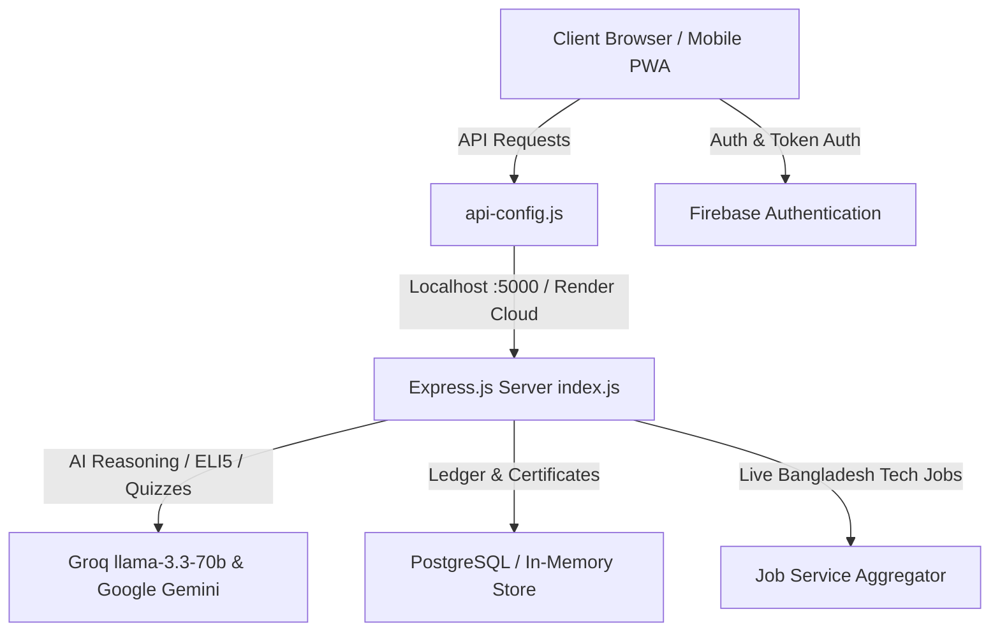

# 🚀 SkillForge AI — Complete Features & Codebase Architecture Guide

> **Official Comprehensive Reference Document**  
> This document provides an exhaustive, feature-by-feature mapping of the entire **SkillForge AI** ecosystem. For every feature implemented in the project, it details the **purpose**, **how it works**, **exact code file locations**, and **line number ranges** for both Frontend and Backend, as well as core concepts to help you master the codebase.

---

## 📑 Table of Contents

1. [System Architecture & Tech Stack Overview](#1-system-architecture--tech-stack-overview)
2. [Feature 1: AI-Powered ELI5 ("Explain Like I'm 5") Learning Engine](#feature-1-ai-powered-eli5-explain-like-im-5-learning-engine)
3. [Feature 2: Dynamic AI Quiz Engine & 12-Hour Cooldown Penalty System](#feature-2-dynamic-ai-quiz-engine--12-hour-cooldown-penalty-system)
4. [Feature 3: Interactive Node-and-Edge Visual Roadmap](#feature-3-interactive-node-and-edge-visual-roadmap)
5. [Feature 4: Cryptographic HMAC-SHA256 Verifiable Certificate Authority](#feature-4-cryptographic-hmac-sha256-verifiable-certificate-authority)
6. [Feature 5: AI Tech Job Matcher & Skill Scoring Engine](#feature-5-ai-tech-job-matcher--skill-scoring-engine)
7. [Feature 6: Firebase Cloud Authentication & Session Sync](#feature-6-firebase-cloud-authentication--session-sync)
8. [Feature 7: Learning Dashboard, Analytics & Mastery Tracking](#feature-7-learning-dashboard-analytics--mastery-tracking)
9. [Feature 8: Hands-On Guided Projects & Milestone Verification](#feature-8-hands-on-guided-projects--milestone-verification)
10. [Feature 9: User Profile, Gamified Badges & Skill Portfolio](#feature-9-user-profile-gamified-badges--skill-portfolio)
11. [Feature 10: Client API Configuration & Auto-Environment Routing](#feature-10-client-api-configuration--auto-environment-routing)
12. [Feature 11: Universal Responsive Mobile Design & Slide-out Drawer](#feature-11-universal-responsive-mobile-design--slide-out-drawer)
13. [Feature 12: Backend Express Core, Middleware & Database Pooling](#feature-12-backend-express-core-middleware--database-pooling)

---

## 1. System Architecture & Tech Stack Overview

SkillForge AI is built using a clean, modern decoupled architecture:

- **Frontend**: Vanilla JavaScript (ES6+), HTML5, CSS3 Glassmorphism design system, Lucide Icons, GSAP & Lenis smooth scrolling. Hosted on **Netlify**.
- **Backend**: Node.js & Express.js REST API with modular MVC architecture (Routes → Controllers → Services → Config). Hosted on **Render**.
- **Database**: PostgreSQL with automatic table bootstrapping and robust in-memory ledger fallbacks.
- **AI Models**: Groq Cloud (`llama-3.3-70b-versatile` & `llama-3.1-8b-instant`) with automatic fallback to Google Gemini (`gemini-2.5-flash` / `gemini-1.5-flash`).
- **Auth**: Firebase v10 SDK (Google OAuth 2.0 & Email/Password).

---

## Feature 1: AI-Powered ELI5 ("Explain Like I'm 5") Learning Engine

### 💡 Purpose & Overview
Provides instant, ultra-simplified, multi-perspective AI explanations for complex computer science topics. Whenever a student clicks on any node/subtopic in the roadmap, the AI breaks it down into 4 clear perspectives: **Quick Summary**, **Real-World Analogy**, **Interactive Code Example**, and **Deep Dive / Common Pitfalls**.

### 📂 Code Location & Line Ranges

#### 1. Backend Service — [eli5Service.js](file:///c:/Users/Encoded%20Habibi/Pictures/TOOLS%20PROJECT/backend/services/eli5Service.js)
- **Lines 1 – 35**: API key validation, model configuration (Groq `llama-3.3-70b-versatile` with multi-key rotation and Gemini fallback).
- **Lines 36 – 120**: `generateLesson({ subtopic, topic })` — AI system prompt crafting, JSON schema enforcement, error handling, and output parsing.
- **Lines 121 – 245**: Failover handlers, Markdown sanitizer, and structured fallback lesson generator for offline resiliency.

#### 2. Backend Controller — [eli5Controller.js](file:///c:/Users/Encoded%20Habibi/Pictures/TOOLS%20PROJECT/backend/controllers/eli5Controller.js)
- **Lines 9 – 50**: `generateLesson(req, res)` — Validates incoming `subtopic` and `topic` body parameters, calls `eli5Service`, and responds with structured JSON `{ success: true, lesson: { summary, analogy, codeExample, deepDive } }`.

#### 3. Backend Route — [eli5Routes.js](file:///c:/Users/Encoded%20Habibi/Pictures/TOOLS%20PROJECT/backend/routes/eli5Routes.js)
- **Lines 1 – 15**: Defines endpoint `POST /api/eli5/generate`.

#### 4. Frontend Client Implementation — [theoretical-roadmap.html](file:///c:/Users/Encoded%20Habibi/Pictures/TOOLS%20PROJECT/frontend/theoretical-roadmap.html)
- **Lines 850 – 980**: Modal UI template, tab switching logic (`Summary`, `Analogy`, `Code`, `Deep Dive`).
- **Lines 981 – 1120**: `fetchLesson(subtopic, topic)` — Async AJAX call to `SKILLFORGE_CONFIG.ELI5_API + '/generate'`, animated skeleton loaders, and live DOM rendering.

---

## Feature 2: Dynamic AI Quiz Engine & 12-Hour Cooldown Penalty System

### 💡 Purpose & Overview
Generates 5 brand-new, never-before-seen conceptual questions for any topic using AI. Features strict anti-repetition hashing (no duplicate questions), automated grading with in-depth answer explanations, and a **12-hour penalty cooldown timer** if the user fails to pass (< 80%), encouraging deep study before retries.

### 📂 Code Location & Line Ranges

#### 1. Backend Service — [geminiQuizService.js](file:///c:/Users/Encoded%20Habibi/Pictures/TOOLS%20PROJECT/backend/services/geminiQuizService.js)
- **Lines 1 – 70**: AI Prompt engineering for 5 multiple-choice questions with 4 distinct options, correct index, and educational explanations.
- **Lines 71 – 165**: Cryptographic SHA-256 question hashing to prevent repeated questions across user attempts.
- **Lines 166 – 280**: Multi-provider fallback orchestration (Groq primary → Gemini secondary → Structured offline fallback).

#### 2. Backend Controller — [quizController.js](file:///c:/Users/Encoded%20Habibi/Pictures/TOOLS%20PROJECT/backend/controllers/quizController.js)
- **Lines 24 – 56**: `ensureSchema()` — Automatic PostgreSQL table creation (`quiz_question_ledger` and `quiz_attempts`).
- **Lines 57 – 140**: `generateQuiz(req, res)` — Generates quiz, logs hashes, strips correct answers from the client payload to prevent cheating.
- **Lines 141 – 250**: `submitQuiz(req, res)` — Grades user submission, computes score & pass rate, records attempt in DB, and enforces 12-hour lock on failure.

#### 3. Backend Route — [quizRoutes.js](file:///c:/Users/Encoded%20Habibi/Pictures/TOOLS%20PROJECT/backend/routes/quizRoutes.js)
- **Lines 1 – 12**: Defines `POST /api/quiz/generate` and `POST /api/quiz/submit`.

#### 4. Frontend Client Implementation — [dashboard.html](file:///c:/Users/Encoded%20Habibi/Pictures/TOOLS%20PROJECT/frontend/dashboard.html) & [theoretical-roadmap.html](file:///c:/Users/Encoded%20Habibi/Pictures/TOOLS%20PROJECT/frontend/theoretical-roadmap.html)
- **dashboard.html (Lines 420 – 580)**: 12-hour countdown timer UI (`11 : 12 : 40`), penalty calculation, `Start Exercise` button trigger.
- **theoretical-roadmap.html (Lines 1125 – 1350)**: Interactive quiz modal, question progression, radio option select, score celebration animation, and answer review panel.

---

## Feature 3: Interactive Node-and-Edge Visual Roadmap

### 💡 Purpose & Overview
An interactive visual knowledge graph rendered with dynamic SVG bezier paths. Nodes represent learning milestones (e.g., HTML, CSS, JavaScript, React, Node.js, Databases). Nodes change states (`Completed`, `Active`, `Locked`) dynamically as users pass milestone assessments.

### 📂 Code Location & Line Ranges

#### 1. Frontend Client — [theoretical-roadmap.html](file:///c:/Users/Encoded%20Habibi/Pictures/TOOLS%20PROJECT/frontend/theoretical-roadmap.html)
- **Lines 180 – 340**: SVG Canvas and Node graph markup with glowing gradients, status indicators, and badges.
- **Lines 400 – 620**: CSS visual effects for node hover, pulse animations, connector edge paths, and unlock transitions.
- **Lines 700 – 845**: Node selection handler, topic info drawer sync, and progress calculation.

#### 2. Backend Controller & Route — [roadmapController.js](file:///c:/Users/Encoded%20Habibi/Pictures/TOOLS%20PROJECT/backend/controllers/roadmapController.js) & [roadmapRoutes.js](file:///c:/Users/Encoded%20Habibi/Pictures/TOOLS%20PROJECT/backend/routes/roadmapRoutes.js)
- **roadmapController.js (Lines 6 – 110)**: `generateRoadmap(req, res)` — Returns full milestone trajectory, step durations, required topics, and prototype projects.

---

## Feature 4: Cryptographic HMAC-SHA256 Verifiable Certificate Authority

### 💡 Purpose & Overview
Issues tamper-proof digital certificates upon roadmap completion. Every certificate contains a unique Certificate ID and a cryptographic HMAC-SHA256 digital signature generated from the learner's name, email, score, and issue timestamp. Employers can verify certificates instantly via public QR code or search ID.

### 📂 Code Location & Line Ranges

#### 1. Backend Controller — [certController.js](file:///c:/Users/Encoded%20Habibi/Pictures/TOOLS%20PROJECT/backend/controllers/certController.js)
- **Lines 11 – 16**: `computeHmacSignature(canonicalString)` — Generates HMAC-SHA256 hex digest using secure server secret key.
- **Lines 18 – 75**: `issueCertificate(req, res)` — Constructs canonical payload (`certId|userEmail|targetRole|score|issuedAt`), generates signature, and saves record.
- **Lines 76 – 160**: `verifyCertificate(req, res)` — Endpoint `GET /api/certificates/verify/:certId` to validate authenticity and detect any tampering.

#### 2. Backend Route — [certRoutes.js](file:///c:/Users/Encoded%20Habibi/Pictures/TOOLS%20PROJECT/backend/routes/certRoutes.js)
- **Lines 1 – 15**: Defines `POST /api/certificates/issue`, `GET /api/certificates/verify/:certId`, and `GET /api/certificates/user/:email`.

#### 3. Frontend Verification Portal — [verify.html](file:///c:/Users/Encoded%20Habibi/Pictures/TOOLS%20PROJECT/frontend/verify.html)
- **Lines 120 – 350**: Certificate verification search box, URL query parameter parser (`?cert=...&sig=...`).
- **Lines 351 – 600**: High-resolution certificate rendering canvas, official watermark seal, verified badge, and Print/PDF export utility.

---

## Feature 5: AI Tech Job Matcher & Skill Scoring Engine

### 💡 Purpose & Overview
Aggregates tech job openings across Bangladesh & Global remote markets. Uses an intelligent matching algorithm to score job requirements against the user's verified SkillForge roadmap milestones, displaying a real-time **Match Score %** badge (e.g., 94% Match) and direct application links.

### 📂 Code Location & Line Ranges

#### 1. Backend Service — [jobService.js](file:///c:/Users/Encoded%20Habibi/Pictures/TOOLS%20PROJECT/backend/services/jobService.js)
- **Lines 1 – 120**: Tech job database index across Frontend, Backend, Full-Stack, Mobile, and DevOps categories.
- **Lines 121 – 210**: `calculateMatchScore(jobSkills, userSkills)` — Computes relevance ratio and skill compatibility score.
- **Lines 211 – 340**: `getJobs(filters)` — Dynamic filtering by Track, Experience level (Entry/Mid/Senior), Work Type (Remote/Onsite/Hybrid), and search query.

#### 2. Backend Controller & Route — [jobController.js](file:///c:/Users/Encoded%20Habibi/Pictures/TOOLS%20PROJECT/backend/controllers/jobController.js) & [jobRoutes.js](file:///c:/Users/Encoded%20Habibi/Pictures/TOOLS%20PROJECT/backend/routes/jobRoutes.js)
- **jobController.js (Lines 10 – 58)**: `listJobs(req, res)` & `getJobDetails(req, res)`.
- **jobRoutes.js (Lines 1 – 15)**: `GET /api/jobs` and `GET /api/jobs/:id`.

#### 3. Frontend Job Board — [jobs.html](file:///c:/Users/Encoded%20Habibi/Pictures/TOOLS%20PROJECT/frontend/jobs.html)
- **Lines 150 – 300**: Search & Filter bar (Track selector, Remote/Onsite toggle, Experience dropdown).
- **Lines 301 – 550**: Dynamic job card grid, match percentage badges, salary tags, tech stack pills, and Quick Apply modal.

---

## Feature 6: Firebase Cloud Authentication & Session Sync

### 💡 Purpose & Overview
Provides secure user authentication via Firebase v10 SDK. Supports 1-Click Google OAuth popup sign-in, Email & Password registration, session persistence across pages, and automatic profile picture/name synchronization.

### 📂 Code Location & Line Ranges

#### 1. Frontend Login Page — [login.html](file:///c:/Users/Encoded%20Habibi/Pictures/TOOLS%20PROJECT/frontend/login.html)
- **Lines 180 – 260**: Google Sign-In button, Email/Password input forms, password toggle.
- **Lines 261 – 370**: Firebase initialization (`firebase.initializeApp`), `signInWithPopup(auth, googleProvider)`, and `signInWithEmailAndPassword`.

#### 2. Frontend Register Page — [register.html](file:///c:/Users/Encoded%20Habibi/Pictures/TOOLS%20PROJECT/frontend/register.html)
- **Lines 190 – 320**: Registration form validation, password strength checker, `createUserWithEmailAndPassword`, and profile seeding.

#### 3. Global Auth & Profile Observer — [app.js](file:///c:/Users/Encoded%20Habibi/Pictures/TOOLS%20PROJECT/frontend/app.js)
- **Lines 320 – 420**: `onAuthStateChanged` listener, local storage session cache (`skillforge_user`), avatar update, and global logout handler.

---

## Feature 7: Learning Dashboard, Analytics & Mastery Tracking

### 💡 Purpose & Overview
The command center for learners. Displays current milestone challenge, live unlock countdown timer, Quiz Accuracy percentage metric, weekly Learning Hours bar chart, Recent Quiz History ledger, and Earned Badges showcase.

### 📂 Code Location & Line Ranges

#### 1. Frontend Dashboard — [dashboard.html](file:///c:/Users/Encoded%20Habibi/Pictures/TOOLS%20PROJECT/frontend/dashboard.html)
- **Lines 120 – 250**: Hero Banner with Current Node challenge (`Node 1: HTML`), progress bar, and Start Exercise action.
- **Lines 251 – 380**: Overview Analytics Cards:
  - **Roadmap Progress** radial completion counter.
  - **Quiz Accuracy** percentage & pass rate trendline.
  - **Learning Hours** weekly bar visualization.
- **Lines 381 – 520**: Recent Quiz History dynamic table and Earned Badges grid.

---

## Feature 8: Hands-On Guided Projects & Milestone Verification

### 💡 Purpose & Overview
Provides hands-on portfolio projects corresponding to each roadmap milestone (e.g., Responsive Landing Page, Real-time Chat App, Full-Stack E-Commerce). Includes step-by-step milestone checklists and GitHub repository submission.

### 📂 Code Location & Line Ranges

#### 1. Frontend Projects Page — [projects.html](file:///c:/Users/Encoded%20Habibi/Pictures/TOOLS%20PROJECT/frontend/projects.html)
- **Lines 140 – 280**: Filterable project catalog categorized by Beginner, Intermediate, and Advanced.
- **Lines 281 – 450**: Project overview cards with estimated duration, skills learned, and live demo/repo links.
- **Lines 451 – 620**: Interactive milestone checklist and project submission modal.

---

## Feature 9: User Profile, Gamified Badges & Skill Portfolio

### 💡 Purpose & Overview
A personalized portfolio page displaying total learning points, daily learning streak counter, earned cryptographic certificates, verified skill badges, and profile management settings.

### 📂 Code Location & Line Ranges

#### 1. Frontend Profile Page — [profile.html](file:///c:/Users/Encoded%20Habibi/Pictures/TOOLS%20PROJECT/frontend/profile.html)
- **Lines 120 – 250**: User profile banner, editable display name, email, and target career role.
- **Lines 251 – 420**: Gamification stats grid (Streak Days, Total Points, Completed Nodes, Quiz Win Rate).
- **Lines 421 – 580**: Badges earned showcase (HTML Master, CSS Wizard, JS Ninja, API Architect) and linked certificates.

---

## Feature 10: Client API Configuration & Auto-Environment Routing

### 💡 Purpose & Overview
A smart centralized configuration module that automatically detects whether the application is running locally (`localhost` / `127.0.0.1` / `file:`) or in production (`netlify.app`), routing all API requests seamlessly to the appropriate backend URL.

### 📂 Code Location & Line Ranges

#### 1. Configuration Script — [api-config.js](file:///c:/Users/Encoded%20Habibi/Pictures/TOOLS%20PROJECT/frontend/api-config.js)
- **Lines 5 – 13**: Environment detection logic (`isLocal`) and URL resolution:
  - Local: `http://localhost:5000`
  - Production: `https://skillforge-ai-backend-bbho.onrender.com`
- **Lines 14 – 24**: Global `window.SKILLFORGE_CONFIG` object exporting clean endpoints for Quizzes, ELI5, Jobs, Roadmaps, and Certificates.

---

## Feature 11: Universal Responsive Mobile Design & Slide-out Drawer

### 💡 Purpose & Overview
Delivers a mobile app experience on smartphones (≤768px). Features a sticky glassmorphic top header, smooth slide-out navigation drawer with crisp contrast, background backdrop blur, touch-optimized cards, and mobile viewports.

### 📂 Code Location & Line Ranges

#### 1. Mobile Navigation Logic — [mobile-nav.js](file:///c:/Users/Encoded%20Habibi/Pictures/TOOLS%20PROJECT/frontend/mobile-nav.js)
- **Lines 9 – 27**: Active route detector matching pathname to current navigation key.
- **Lines 28 – 47**: Dynamic Top Header injection (Hamburger menu button on left, SkillForge logo on right).
- **Lines 48 – 60**: Mobile drawer backdrop creator.
- **Lines 61 – 115**: Drawer open/close interaction handlers with close `✕` button and link-tap listeners.

#### 2. Mobile Responsive Styles — [mobile-nav.css](file:///c:/Users/Encoded%20Habibi/Pictures/TOOLS%20PROJECT/frontend/mobile-nav.css)
- **Lines 6 – 13**: Desktop safety resets (hiding mobile components on screens > 768px).
- **Lines 16 – 48**: Mobile breakpoint container & sticky top header styles.
- **Lines 90 – 150**: Slide-out drawer animations (`transform: translateX`, `z-index: 2000`), backdrop blur (`z-index: 1050`), and close button.
- **Lines 155 – 470**: Page-specific mobile overrides for Dashboard, Roadmap, Quiz, Jobs, Verify, Profile, and Projects.

---

## Feature 12: Backend Express Core, Middleware & Database Pooling

### 💡 Purpose & Overview
The core backend server built on Express.js. Implements CORS security, JSON request body parsing, centralized error handling, PostgreSQL connection pooling via `pg`, and automatic table initialization.

### 📂 Code Location & Line Ranges

#### 1. Express Server Entrypoint — [index.js](file:///c:/Users/Encoded%20Habibi/Pictures/TOOLS%20PROJECT/backend/index.js)
- **Lines 1 – 18**: Express initialization, CORS configuration, JSON middleware.
- **Lines 19 – 25**: API route mounts (`/api/roadmaps`, `/api/certificates`, `/api/quiz`, `/api/eli5`, `/api/jobs`).
- **Lines 26 – 30**: Server health check endpoint `GET /api/health`.
- **Lines 31 – 43**: Global 404 & centralized error handling middleware.

#### 2. Database Connection Pool — [db.js](file:///c:/Users/Encoded%20Habibi/Pictures/TOOLS%20PROJECT/backend/config/db.js)
- **Lines 1 – 28**: PostgreSQL Pool setup using `process.env.DATABASE_URL` with SSL rejection bypass for cloud databases (Neon, Render).

#### 3. Database Schema Files — [schema.sql](file:///c:/Users/Encoded%20Habibi/Pictures/TOOLS%20PROJECT/backend/db/schema.sql) & [quiz_schema.sql](file:///c:/Users/Encoded%20Habibi/Pictures/TOOLS%20PROJECT/backend/db/quiz_schema.sql)
- **schema.sql (Lines 1 – 65)**: Table definitions for `users`, `roadmaps`, `certificates`, `jobs_cache`.
- **quiz_schema.sql (Lines 1 – 75)**: Table definitions for `quiz_question_ledger` and `quiz_attempts`.

---

## 🎯 Summary Reference Table

| Feature Name | Primary Frontend File | Primary Backend File | Key API Route |
|---|---|---|---|
| **ELI5 AI Lessons** | [theoretical-roadmap.html](file:///c:/Users/Encoded%20Habibi/Pictures/TOOLS%20PROJECT/frontend/theoretical-roadmap.html#L850) | [eli5Service.js](file:///c:/Users/Encoded%20Habibi/Pictures/TOOLS%20PROJECT/backend/services/eli5Service.js) / [eli5Controller.js](file:///c:/Users/Encoded%20Habibi/Pictures/TOOLS%20PROJECT/backend/controllers/eli5Controller.js) | `POST /api/eli5/generate` |
| **AI Quiz & 12h Cooldown** | [dashboard.html](file:///c:/Users/Encoded%20Habibi/Pictures/TOOLS%20PROJECT/frontend/dashboard.html#L420) | [geminiQuizService.js](file:///c:/Users/Encoded%20Habibi/Pictures/TOOLS%20PROJECT/backend/services/geminiQuizService.js) / [quizController.js](file:///c:/Users/Encoded%20Habibi/Pictures/TOOLS%20PROJECT/backend/controllers/quizController.js) | `POST /api/quiz/generate`, `POST /api/quiz/submit` |
| **Roadmap Graph** | [theoretical-roadmap.html](file:///c:/Users/Encoded%20Habibi/Pictures/TOOLS%20PROJECT/frontend/theoretical-roadmap.html#L180) | [roadmapController.js](file:///c:/Users/Encoded%20Habibi/Pictures/TOOLS%20PROJECT/backend/controllers/roadmapController.js) | `POST /api/roadmaps/generate` |
| **Verifiable Certificates**| [verify.html](file:///c:/Users/Encoded%20Habibi/Pictures/TOOLS%20PROJECT/frontend/verify.html#L120) | [certController.js](file:///c:/Users/Encoded%20Habibi/Pictures/TOOLS%20PROJECT/backend/controllers/certController.js) | `POST /api/certificates/issue`, `GET /api/certificates/verify/:certId` |
| **AI Job Matcher** | [jobs.html](file:///c:/Users/Encoded%20Habibi/Pictures/TOOLS%20PROJECT/frontend/jobs.html#L150) | [jobService.js](file:///c:/Users/Encoded%20Habibi/Pictures/TOOLS%20PROJECT/backend/services/jobService.js) / [jobController.js](file:///c:/Users/Encoded%20Habibi/Pictures/TOOLS%20PROJECT/backend/controllers/jobController.js) | `GET /api/jobs`, `GET /api/jobs/:id` |
| **Firebase Auth** | [login.html](file:///c:/Users/Encoded%20Habibi/Pictures/TOOLS%20PROJECT/frontend/login.html) / [register.html](file:///c:/Users/Encoded%20Habibi/Pictures/TOOLS%20PROJECT/frontend/register.html) | [app.js](file:///c:/Users/Encoded%20Habibi/Pictures/TOOLS%20PROJECT/frontend/app.js#L320) | Firebase SDK Client OAuth |
| **Mobile Drawer System** | [mobile-nav.js](file:///c:/Users/Encoded%20Habibi/Pictures/TOOLS%20PROJECT/frontend/mobile-nav.js) | [mobile-nav.css](file:///c:/Users/Encoded%20Habibi/Pictures/TOOLS%20PROJECT/frontend/mobile-nav.css) | Client DOM Injection |
| **Server & DB Pooling** | [api-config.js](file:///c:/Users/Encoded%20Habibi/Pictures/TOOLS%20PROJECT/frontend/api-config.js) | [index.js](file:///c:/Users/Encoded%20Habibi/Pictures/TOOLS%20PROJECT/backend/index.js) / [db.js](file:///c:/Users/Encoded%20Habibi/Pictures/TOOLS%20PROJECT/backend/config/db.js) | `GET /api/health` |
